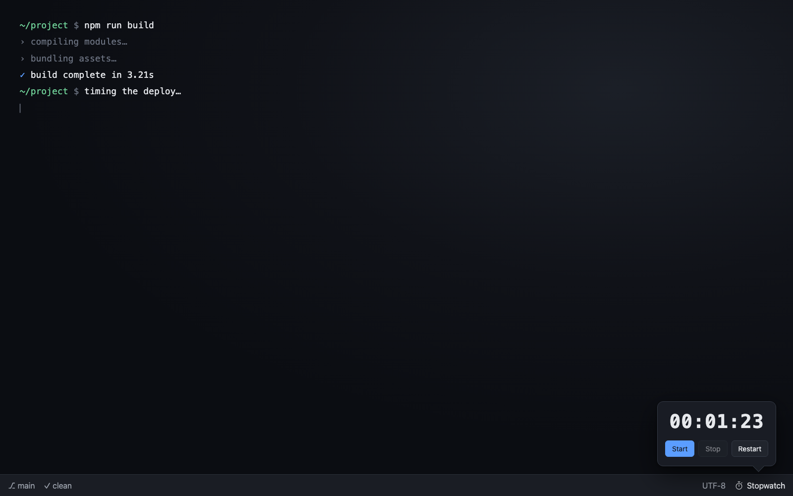

# Stopwatch

A simple stopwatch for the Muxy status bar. Adds a stopwatch icon to the right
side of the footer status bar; click it to open a small popover with a live
`HH:MM:SS` readout and three controls — **Start**, **Stop**, **Restart**. Click
outside to dismiss.



## Controls

- **Start** — begins counting, or resumes after a stop.
- **Stop** — pauses and freezes the elapsed time.
- **Restart** — resets to `00:00:00` and immediately starts counting again.

The stopwatch keeps running while the popover is closed: it persists its state
to `localStorage` and computes elapsed time from the stored start timestamp, so
reopening the popover shows the correct time. There is no background process.

## Permissions

- **`panels:write`** — lets the popover size itself to its content
  (`muxy.popover.resize`). No network, no shell, no workspace access.

## How it works

- A `statusBarItem` (right side, stopwatch icon) runs the `open` command.
- That command's `openPopover` action opens the `stopwatch` popover.
- `popovers/stopwatch.html` renders the elapsed time and the three buttons,
  updating roughly four times a second while running. It uses the injected
  `--muxy-*` theme variables and a transparent background so the native popover
  material shows through.

## Building

This extension is an npm + Vite project. The manifest lives under the `"muxy"`
key in `package.json` (there is no `manifest.json`).

```sh
npm install
npm run build   # emits the installable extension into dist/
```

`vite build` writes `dist/popovers/stopwatch.html` (with its CSS/JS bundled) and
copies the listing assets from `public/assets/` to `dist/assets/`. The `dist/`
directory is the installed extension, so all paths in the `"muxy"` block are
resolved relative to it. Use `npm run dev` for a local dev server.

## License

MIT
